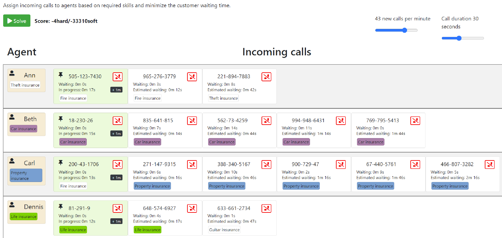

= Call center real-time scheduling with setup avoidance

Schedule incoming calls to employees matching skills and availability.

Created by adopting the great example from https://github.com/kiegroup/optaplanner-quickstarts/tree/stable/use-cases/call-center

Discussed in https://groups.google.com/g/optaplanner-dev/c/wnalNxLT3Jw

Changes compared to the original are

* Simplified `Call`s to have just one required skill
* If 2 subsequent calls have a different required skill, a setup cost occurs (expressed via a constraint).

In the current implementation imposes a setup cost used. It would be also very easy to change `getDurationTillPickUp` to model a setup-time instead.

TIP: In addition to the quarkus mode, here we also include `org.acme.callcenter.CallCenterApp` to run the solver without any interface.

.Example schedule of the call center. Clearly setup is avoided where possible

== Run the application with live coding

. Git clone the optaplanner-quickstarts repo:
+
[source, shell]
----
$ git clone https://github.com/kiegroup/optaplanner-quickstarts.git
...
$ cd optaplanner-quickstarts/use-cases/call-center
----

. Start the application:
+
[source, shell]
----
$ mvn quarkus:dev
----

. Visit http://localhost:8080 in your browser.

. Click on the *Solve* button.

Then try _live coding_:

. Make some changes in the source code.
. Refresh your browser (F5).

Notice that those changes are immediately in effect.

== Package and run the application

When you're done iterating in `quarkus:dev` mode, run the application as a conventional jar file.

. Compile it:
+
[source, shell]
----
$ mvn package
----

. Run it:
+
[source, shell]
----
$ java -jar ./target/quarkus-app/quarkus-run.jar
----
+
[NOTE]
====
To run it on port 8081 instead, add `-Dquarkus.http.port=8081`.
====

. Visit http://localhost:8080 in your browser.

== Run a native executable

. https://quarkus.io/guides/building-native-image#configuring-graalvm[Install GraalVM and gu install the native-image tool]

. Compile it natively:
+
[source, shell]
----
$ mvn package -Dnative -DskipTests
----

. Run the native executable:
+
[source, shell]
----
$ ./target/*-runner
----

. Visit http://localhost:8080 in your browser.

== More information

Visit https://www.optaplanner.org/[www.optaplanner.org].
